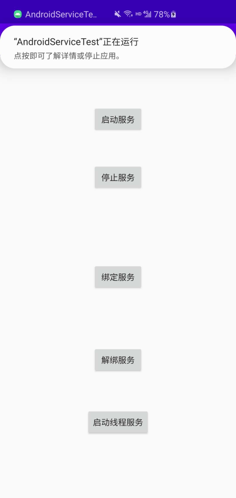
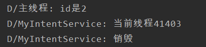

# 目录
- [服务是什么](#服务是什么)
- [线程](#线程)
	- [线程的基本使用](#线程的基本使用)
	- [子线程更新UI](#子线程更新UI)
- [服务的基本用法](#服务的基本用法)
	- [定义和启动服务](#定义和启动服务)
	- [活动和服务进行通信](#活动和服务进行通信)
- [服务的生命周期](#服务的生命周期)
- [使用前台服务](#使用前台服务)
- [使用IntentService](#使用IntentService)


# [服务是什么](#目录)
- 服务是实现程序在后台运行的解决方案，如果有需要长期执行并且不需要和用户进行交互的任务，那么服务是其最好的实现方法。但是，服务并不是独立的进程，它还是依赖于应用程序的进程，并且服务自己不会开启线程，所有代码都是**默认运行在主线程中的**，所以我们需要在服务内部创建子线程，并执行具体任务。所以我们记下来先学习一下线程的知识。


# [线程](#目录)
- 如果我们想执行类似网络请求等操作，通常是放在线程中完成的，因为如果服务器不是立刻相应我们的请求，而我们又没有将其放在子线程中，那么很有可能造成线程阻塞。

## [线程的基本使用](#目录)
- 启动线程的方法有很多，比如定义一个自己的线程类，但是这种方法==耦合性==很高，所以我们选择实现一个接口，并在线程中运行，如：

```java
class MyThread implements Runnable()
{
	@ Override
	public void run()
	{
		//具体逻辑
	}
}

MyThread myThread = new MyThread();
new Thread(myThread).start();
```

## [子线程更新UI](#目录)
- 在Android中子线程实际上是不能更新UI的，因为UI是线程不安全的，但是有些时候我们又必须通过子线程对UI进行一定的调整，所以我们可以通过异步消息处理来实现这个功能。在Android中，线程一共有4个重要的对象：
	- **1. Message**
	Message是线程之间进行通信的消息，主要有 `.what` 和 `.obj` 两个对象，前者可以用于进行信号的标识，后者用于携带一些数据。
	- **2. Handler**
	handler是各个线程处理和收发消息的对象，向某个线程发送Message就使用 `handler.sendMessage()` 方法。而发出的消息经过一系列辗转处理之后也会回到Handler的 `handlerMessage()` 方法中。
	- **3. MessageQueue**
	MessageQueue是每个线程存放Message的地方，每个线程有且只有一个MessageQueue。
	- **4. Looper**
	Looper是每个线程中管理 `MessageQueue` 的对象，如果MessageQueue中有Message，Looper就会将消息取出，发送给 `handlerMessage()` 进行处理。

- 接下来，我们通过一个实例来实现子线程更新UI，总体思路是通过按钮点击事件，让子线程给主线程发送消息，主线程接到消息后，就对UI进行更新。

```java
private Button changeText;
private TextView textView;

private static final int CHANGE_TEXT = 1;

private Handler handler = new Handler()
{
    @Override
    public void handleMessage(@NonNull Message msg) {
        super.handleMessage(msg);
        switch (msg.what)
        {
            case CHANGE_TEXT:
                textView.setText("have been changed");
                break;
            default:
                break;
        }
    }
};
```

```java
protected void onCreate(Bundle savedInstanceState) 
{
    super.onCreate(savedInstanceState);
    setContentView(R.layout.activity_main);
    changeText = findViewById(R.id.changeText);
    textView = findViewById(R.id.textView);

    changeText.setOnClickListener(this);
}

@Override
public void onClick(View v) {
    switch (v.getId())
    {
        case R.id.changeText:
//            Message message = new Message();
            Message message = Message.obtain();
            message.what = CHANGE_TEXT;
            handler.sendMessage(message);
            break;
        default:
            break;
    }
}
```


# [服务的基本用法](#目录)

## 定义和启动服务

- 接下来我们看一下服务的基本用法，首先我们需要定义一个自己的服务，叫做 `MyService`。服务属于Android的四大组件，都要在 `AndroidManifest.xml` 中进行注册，由于我们用AndroidStudio进行声明的，所以已经注册完成了。service除了名字外，还有两个属性需要声明：`exported` 和  `enabled`。前者代表其他应用是否可以访问这个服务，后者代表是否启用这个服务。
```xml
<service
	android:name=".MyService"
  android:enabled="true"
  android:exported="true" />
```

- 新建服务后我们需要重写三个较为常见的方法，`onCreate()`，`onStartCommand()`，`onDestroy()`。分别代表服务创建，启动和销毁时应当做的操作，这里我们可以在日志中打印这些过程。

```java
@Override
public void onCreate() {
    super.onCreate();
    Log.d("MyService","创建");
}

@Override
public int onStartCommand(Intent intent, int flags, int startId) {
    Log.d("MyService", "开启");
    return super.onStartCommand(intent, flags, startId);
}

@Override
public void onDestroy() {
    Log.d("MyService","销毁");
    super.onDestroy();
}
```

- 接着，我们通过按钮点击事件来看看服务的整个过程，由于服务是依赖于Activity存在的，所以启动和关闭服务都需要通过Intent来完成，但是与启动一个Activity不同，服务的开启和关闭是通过 `startService()` 和 `stopService()` 来完成的。

```java
public void onClick(View v) {
    switch (v.getId())
    {
        case R.id.startService:
            Intent startIntent = new Intent(ServiceTest.this, MyService.class);
            startService(startIntent);
            break;
        case R.id.stopService:
            Intent stopIntent = new Intent(ServiceTest.this, MyService.class);
            stopService(stopIntent);
            break;
        default:
            break;
    }
}
```


## 活动和服务进行通信
- 虽然刚刚我们启动了一个服务，但是一旦服务启动了，就和我们的Activity没什么关系了，相当于Activity只是允许服务进行启动，现在我们想让活动和服务关系更加紧密，能通过活动对服务进行一些控制，那么现在我们需要借助 `MyService` 中的 `onBind()` 绑定方法了。首先我们要在 `Myservice` 中定义一个自己的Binder类，并在其中定义一些功能，比如 `startDownload()` 和 `getProgress()`。

```java
private DownloadBinder mBinder;
    
class DownloadBinder extends Binder
{
    public void startDownload()
    {
        Log.d("MyService", "开始下载");
    }

    public void getProgress()
    {
        Log.d("MyService", "下载进度:50%");
    }
}

...

@Override
public IBinder onBind(Intent intent) {
    return mBinder;
}
```

- 接着，我们需要在活动中去调用这些方法。首先我们要将活动与服务绑定，实现这个功能我们需要一个 `ServiceConnection` 对象，并且在初始化这个对象时我们就可以指出一旦活动与服务绑定，就执行下载和读取进度操作。

```java
private MyService.DownloadBinder downloadBinder;
private ServiceConnection connection = new ServiceConnection() {
    @Override
    public void onServiceConnected(ComponentName name, IBinder service) {
        downloadBinder = (MyService.DownloadBinder) service;
        downloadBinder.startDownload();
        downloadBinder.getProgress();
    }

    @Override
    public void onServiceDisconnected(ComponentName name) {

    }
};
```

- 最后我们通过点击事件完成活动与事件的绑定与解除，这就要用到 `bindService()` 和 `unbindService()` 方法了。前者传入三个参数intent，connection和一个标志位，后者只需要传入一个connection即可。

```java
case R.id.bindService:
	Intent bindService = new Intent(ServiceTest.this, MyService.class);
	bindService(bindService, connection, BIND_AUTO_CREATE);
	break;
case R.id.unbindService:
	unbindService(connection);
```


# [服务的生命周期](#目录)
- 我们在前面用到的 `onCreate()`，`onStartCommand()`，`onBind()`，`onDestory()` 都是服务的生命周期中可能回调的方法。一旦项目在任何位置调用了 `startService()` 方法，那么服务就相应的启动起来，并回调 `onStartCommand` 方法。如果这个活动还没有创建过，那么会首先调用 `onCreate()` 方法创建服务。服务启动之后会保持运行状态，直到 `stopService()` 方法或 `stopSelf()` 方法被调用（这个方法还没见过）。

- 当我们用 `bindService()` 方法绑定服务时，服务中的 `onBind()` 方法就被调用，如果这个服务没有被创建，则会首先调用 `onCreate()` 方法，并且 `onStartCommand` 方法不会被调用。 只要连接没有断开，服务就会一直保持运行的状态。

- 当我们 `bindService()` 又 `unbindService()` 时，会调用 `onDestroy()` 方法销毁服务，但如果我们既 `startService()` 又 `bindService()` 后，必须既 `stopService()` 又 `unbindService()` 才能调用 `onDestroy()` 方法销毁服务。因为Android的机制就是一个服务如果想要被销毁，就必须既解绑，又不被启动。


# [使用前台服务](#目录)
- 服务几乎都是在后台运行的，系统优先级比较低，当内存不够的时候就会回收掉正在后台运行的服务。如果我们希望服务一直运行，则可以考虑前台服务，它会在通知栏显示一个正在运行的图标，这与通知非常相似，下拉状态栏就可以看到更详细的信息。想实现前台服务，我们只需要在 `onCreate()` 方法中定义一个通知对象，并用 `startForegroud()` 方法让它在前台运行即可。

```java
Intent intent = new Intent(this, MainActivity.class);
PendingIntent pendingIntent = PendingIntent.getActivity(getApplicationContext(), 0, 		intent, 0); //其实这句不知道有什么作用，因为加不加点击之后效果都是一样的。
NotificationCompat.Builder builder;
NotificationManager manager = (NotificationManager) getSystemService(NOTIFICATION_SERVICE);
if (Build.VERSION.SDK_INT >= Build.VERSION_CODES.O)
{
    NotificationChannel notificationChannel = new NotificationChannel("前台服务",getString(R.string.app_name), NotificationManager.IMPORTANCE_LOW);
    manager.createNotificationChannel(notificationChannel);
    builder = new NotificationCompat.Builder(getApplicationContext(), "前台服务");
}

else
{
    builder = new NotificationCompat.Builder(getApplicationContext());
}

builder.setContentTitle("this is Title")
    .setContentText("this is Content")
    .setWhen(System.currentTimeMillis())
    .setContentIntent(pendingIntent);

Notification notification = builder.build();
startForeground(1, notification);
```




# [使用IntentService](#目录)
- 服务默认是运行在主线程中的，如果执行的是一些非常耗时的操作，那么就很容易出现ANR（Application Not Responding）。我们应该在服务的每一个操作中开启一个子线程，处理这些耗时的逻辑，比如我们可以在 `onStartCommand()` 方法中开启一个线程，并在其完成任务使用 `stopself()` 方法将其关闭，但是如果忘记开启线程或忘了关闭的话就会有问题。所以Android提供了一个` IntentService` 类来帮助我们完成服务中开启线程。我们需要构造一个继承这个类的自己的 `MyIntentService`。
- 在这个类中有三个方法需要我们注意，第一个是无参的构造函数，在调用父类的构造函数时，我们需要传入一个字符串作为名字，可以随便取，但是一般取自己的类的名字。第二个方法是 `onHandlerIntent(Intent intent)`，所有在线程中做的操作都放在这个函数中。第三个方法是 `onDestroy()`，表示所有工作完成后服务自动销毁。最后， `IntentService` 也是一种服务，所以我们要在 `AndroidManifest.xml` 中注册它

```xml
<service android:name=".MyIntentService"/>
```

```java
public class MyIntentService extends IntentService {
    public MyIntentService() {
        super("test IntentService");
    }

    @Override
    protected void onHandleIntent(@Nullable Intent intent) {
        Log.d("MyIntentService","当前线程"+Thread.currentThread().getId());
    }

    @Override
    public void onDestroy() {
        super.onDestroy();
        Log.d("MyIntentService","销毁");
    }
}
```

```java
case R.id.startIntentService:
    Log.d("主线程","id是"+Thread.currentThread().getId());
    Intent intent = new Intent(ServiceTest.this, MyIntentService.class);
    startService(intent);
```



