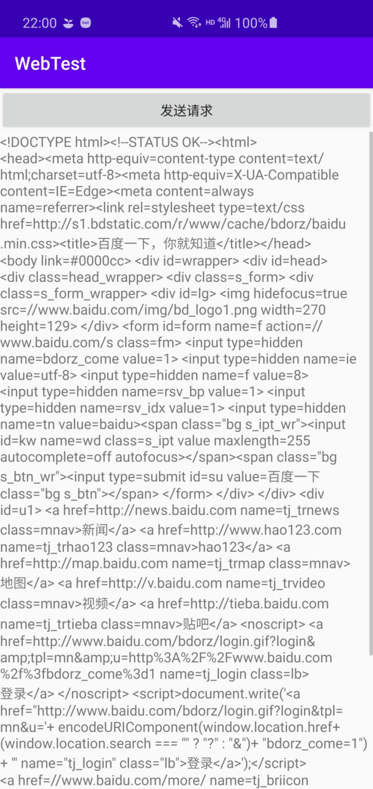

# 目录
- [WebView的应用](#WebView的应用)
- [使用HttpURLConnection](#使用HttpURLConnection)
- [使用OKHttp](#使用OKHttp)


# [WebView的应用](#目录)
- 有时我们需要在自己的app种打开一个网页，但是又不想从浏览器打开，这时我们就可以用到WebView，从而展示各种各样的网页。我们先用WebView展示百度的网页，看下效果。
	- 首先我们通过 `WebView.getSettings().setJavaScriptEnabled(true)`方法 让WebView支持JavaScript；
	- 接着我们希望从一个网页跳转到另一个网页的时候，仍然是在这个WebView中显示，所以需要用到 `WebView.setWebViewClient(new WebViewCilent())` 方法；
	- 最后我们用 `WebView.loadUrl()` 加上访问地址。
	- 当然还需要在 `AndroidManifest.xml` 中声明网络权限。

```xml
<uses-permission android:name="android.permission.INTERNET"/>
```

```java
webView.getSettings().setJavaScriptEnabled(true);
webView.setWebViewClient(new WebViewClient());
webView.loadUrl("http://www.baidu.com");
```

- 需要注意的是，从Android9.0开始，系统限制了明文流量的访问请求，对未加密的流量不再信任，从而直接放弃请求。我们有以下方法解决这个问题：
	- 在 `AndroidManifest.xml` 中打开一个开关，在 `<application>` 标签中加上 `android:usesCleartextTraffic="true"`

	- 将请求改为 `https` （该方法需要服务器也支持https）


# [使用HttpURLConnection](#目录)
- WebView实际上是帮我们封装好了整个请求的过程，但是大多数时候还是想自己去进行网络申请，官方API是 `HttpURLConnection`。首先我们需要获取一个URL实例，接着调用 `URL.openConnection()` 方法获取连接，接着设置请求模式，超时时间等属性。
- 读取连接的内容则稍显麻烦，`HttpURLConnection` 返回的是一个输入流，需要装成`StringBuilder`类才能进行读取。

```java
new Thread(new Runnable() {
    @Override
    public void run() {
        HttpURLConnection httpURLConnection = null;
        BufferedReader bufferedReader = null;
        try
        {
            URL url = new URL("http://www.baidu.com");
            httpURLConnection = (HttpURLConnection) url.openConnection();
            httpURLConnection.setRequestMethod("GET");
            httpURLConnection.setConnectTimeout(8000);

            InputStream inputStream = httpURLConnection.getInputStream();
            bufferedReader = new BufferedReader(new InputStreamReader(inputStream));
            StringBuilder response = new StringBuilder();
            String line;
            while ((line = bufferedReader.readLine()) != null)
            {
                response.append(line);
            }
            showResponse(response);
        }catch (Exception e)
        {
            e.printStackTrace();
        }
    }
}).start();
```

```java
public void showResponse(final StringBuilder response)
{
    runOnUiThread(new Runnable() {
        @Override
        public void run() {
	        responseText.setText(response);
        }
    });
}
```




# [使用OKHttp](#目录)
- 就像LitePal一样，OKHttp也是一个十分优秀的开源库，大大简化了发送网络请求的步骤，当然要想用这个开源库，必须要在 `build.gradle` 文件中引用它：

```xml
implementation 'com.squareup.okhttp3:okhttp:4.8.1'
```

- 通过OKHttp进行访问主要有两个对象，`OKHttpClient` 和 `Request`。访问的所有内容，包括URL等都通过 `Request` 来设置，而执行则通过 `Client` 。

```java
new Thread(new Runnable() {
    @Override
    public void run() {
        try
        {
            OkHttpClient client = new OkHttpClient();
            Request request = new Request.Builder()
                .url("http://www.baidu.com")
                .build();
            Response response = client.newCall(request).execute();
            String responseData = response.body().string();
            showResponse(responseData);


        }catch (Exception e)
        {
            e.printStackTrace();
        }

    }
}).start();
```